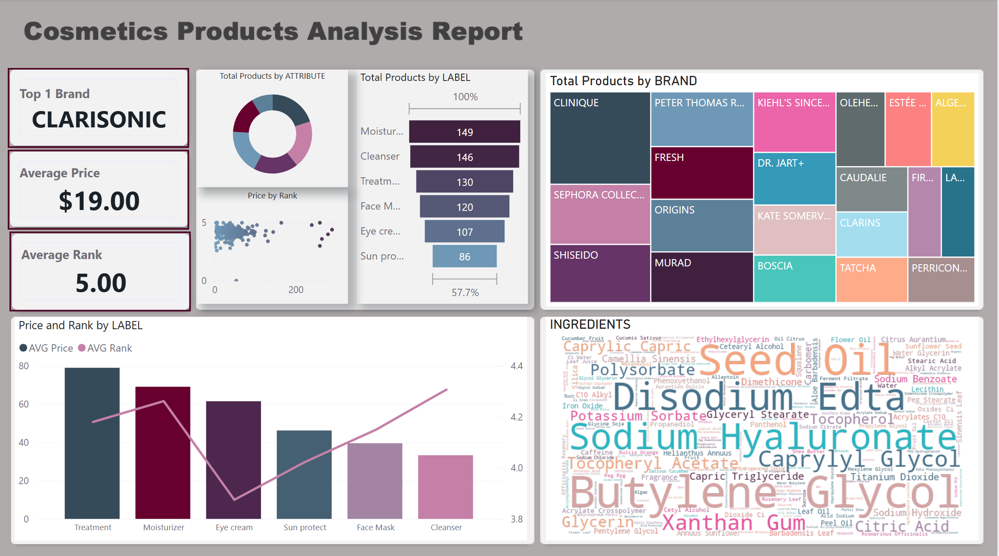

# Cosmetics Data Pipeline - ELT Project

## Table of Contents

- [Overview](#overview)
- [Project Architecture](#project-architecture)
- [Technology Stack](#technology-stack)
- [Data Flow](#data-flow)
- [Infrastructure as Code (Terraform)](#infrastructure-as-code-terraform)
- [CI/CD with GitHub Actions](#cicd-with-github-actions)
- [Project Structure](#project-structure)
- [Report Sample](#report-sample)

## Overview

This project implements a modern ELT (Extract, Load, Transform) data pipeline for cosmetics product data using the **Medallion Architecture** pattern. The pipeline processes raw CSV data through three distinct layers (Bronze, Silver, Gold) with integrated data quality validation and automated orchestration.

## Project Architecture


The architecture follows a medallion pattern with:
- **S3** as the source data lake
- **Snowflake** as the data warehouse platform
- **Three-tier processing**: Bronze (raw), Silver (cleansed), Gold (curated)
- **Automated orchestration** via Snowflake Tasks
- **Data quality checks** via Great Expectations

## Technology Stack

- **Snowflake**: Data warehouse with Iceberg tables, Streams, and Tasks for orchestration
- **Great Expectations**: Data quality validation with automatic quarantine routing
- **Snowpark Python**: DataFrame-based transformations with pushdown optimization
- **Terraform**: Infrastructure as Code for Snowflake resources
- **GitHub Actions**: CI/CD automation for pipeline deployment
- **Power BI**: Business intelligence and reporting

## Data Flow

The pipeline automatically processes data from S3 through Bronze → Silver → Gold → Report layers using event-driven orchestration:

### 1. File Upload to S3

When new CSV files are uploaded to S3 `raw/` directory:
- **S3 Stage**: `STAGE_TRIGGER_COSMETICS_DB_DEV` monitors the `raw/` directory with `DIRECTORY = (ENABLE = TRUE, AUTO_REFRESH = TRUE)`
- **Stream Detection**: `STREAM_TRIGGER_COSMETICS_DB_DEV` detects new file arrivals via Stage directory monitoring

### 2. Bronze Layer Trigger

**BRONZE_TASK** automatically executes:
- **Schedule**: Every 5 minutes
- **Trigger Condition**: `SYSTEM$STREAM_HAS_DATA('STREAM_TRIGGER_COSMETICS_DB_DEV')` detects new files
- **Processing**:
  - Reads CSV files from S3 Stage
  - Appends metadata (`SOURCE_FILE`, `SOURCE_PATH`, `LOAD_TIME`)
  - Validates data quality using Great Expectations
  - Routes valid data to `COSMETICS_BZ` table (Iceberg)
  - Isolates invalid data in `DATA_QUALITY_QUARANTINE` table
  - Creates Stream `COSMETICS_BZ_STREAM` for downstream consumption

### 3. Silver Layer Trigger

**SILVER_TASK** automatically executes:
- **Trigger**: After `BRONZE_TASK` completes successfully
- **Trigger Condition**: `SYSTEM$STREAM_HAS_DATA('COSMETICS_BZ_STREAM')` detects new Bronze records
- **Processing**:
  - Reads incremental changes from `COSMETICS_BZ_STREAM`
  - Cleanses data (replaces nulls, standardizes placeholders)
  - Deduplicates by product name (latest record wins)
  - Writes to `COSMETICS_SL` table (Iceberg)
  - Creates Stream `COSMETICS_SL_STREAM` for Gold layer

### 4. Gold Layer Trigger

**GOLD_TASK** automatically executes:
- **Trigger**: After `SILVER_TASK` completes successfully
- **Trigger Condition**: `SYSTEM$STREAM_HAS_DATA('COSMETICS_SL_STREAM')` detects new Silver records
- **Processing**:
  - Reads incremental changes from `COSMETICS_SL_STREAM`
  - Transforms into dimensional model:
    - **Fact Table**: `FACT_COSMETICS_GL` (product-level facts)
    - **Dimension Tables**: `DIM_BRAND_GL`, `DIM_LABEL_GL`, `DIM_ATTRIBUTE_GL`
  - Unpivots skin type flags into attribute rows

### 5. Report Refresh

**Power BI** automatically reflects updates:
- **Connection**: Direct connection to Gold layer tables in Snowflake
- **Auto-refresh**: Power BI dataset refreshes based on scheduled or on-demand triggers
- **Data Source**: Queries `FACT_COSMETICS_GL` and dimension tables for visualizations

### Key Features

- ✅ **Event-driven**: Tasks trigger automatically when data is available (no manual intervention)
- ✅ **Incremental Processing**: Streams ensure only new/changed data is processed
- ✅ **Dependency Chain**: `BRONZE_TASK → SILVER_TASK → GOLD_TASK` ensures proper sequencing
- ✅ **Idempotency**: File tracking prevents duplicate processing
- ✅ **Error Handling**: Failed tasks prevent downstream execution

## Infrastructure as Code (Terraform)

The project uses Terraform to manage Snowflake infrastructure resources:

### Setup

1. **Configure Snowflake Provider Authentication**:
   - Uses key-pair authentication with `snowflake_tf_key.p8` private key
   - Set environment variables:
     ```bash
     export SNOWFLAKE_USER="your_user"
     export SNOWFLAKE_ACCOUNT="your_account"
     export SNOWFLAKE_ROLE="your_role"
     export SNOWFLAKE_WAREHOUSE="your_warehouse"
     ```

2. **Terraform Configuration**:
   - `terraform/main.tf`: Defines Snowflake database and schema resources
   - `terraform/providers.tf`: Configures Snowflake provider (version ~> 0.87)

### Usage

```bash
cd terraform
terraform init
terraform plan
terraform apply
```

### Managed Resources

- **Database**: `COSMETICS_DB_DEV`
- **Schema**: `COSMETICS` schema with 1-day data retention

## CI/CD with GitHub Actions

The project includes CI/CD automation for continuous integration and deployment:

### Workflow Features

- **Automated Testing**: Run data quality checks and validation on pipeline code
- **Infrastructure Deployment**: Apply Terraform changes to Snowflake
- **Pipeline Deployment**: Deploy Snowflake stored procedures and tasks
- **Validation**: Verify schema changes and data transformations

### Setup

1. **Configure GitHub Secrets**:
   - `SNOWFLAKE_USER`: Snowflake username
   - `SNOWFLAKE_ACCOUNT`: Snowflake account identifier
   - `SNOWFLAKE_PRIVATE_KEY`: Base64-encoded private key (`snowflake_tf_key.p8`)
   - `SNOWFLAKE_ROLE`: Snowflake role for deployment
   - `SNOWFLAKE_WAREHOUSE`: Snowflake warehouse name

2. **Workflow Triggers**:
   - Push to `main` branch: Deploy to production
   - Pull requests: Run validation and tests
   - Manual dispatch: On-demand deployment

### Example Workflow

```yaml
name: Deploy Pipeline
on:
  push:
    branches: [main]
  workflow_dispatch:
```

## Project Structure

```
11_snowflake_cosmetics_ELT/
├── data/                          # Source data and utilities
│   ├── cosmetics.csv             # Original dataset
│   ├── remerge.py                # CSV splitting utility
│   └── split_files/              # Split CSV files for incremental testing
│
├── infrastructure/                # Infrastructure setup scripts
│   ├── setup.py                  # Database setup helper
│   ├── setup_infra.sql           # SQL infrastructure setup
│   ├── setup_tables.py           # Table creation scripts
│   └── setup_gx.py               # Great Expectations setup
│
├── pipelines/                     # Pipeline code
│   ├── main_pipeline.py          # Entry point functions for each layer
│   ├── bronze.py                 # Bronze layer processing
│   ├── silver.py                 # Silver layer processing
│   ├── gold.py                   # Gold layer processing
│   └── great_expectations_common.py  # GX validation logic
│
├── orchestration/                 # Task orchestration
│   └── deploy_dags.sql           # Task deployment SQL
│
├── terraform/                     # Infrastructure as Code
│   ├── main.tf                   # Snowflake resources
│   └── providers.tf              # Terraform provider configuration
│
└── report/                        # Reporting assets
    ├── cosmetics_report.pbix     # Power BI report
    └── sample/
        └── dashboard.png         # Dashboard screenshot
```

## Report Sample


